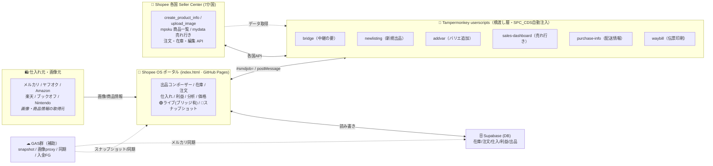
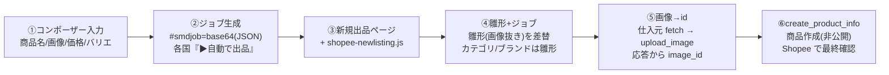

# Shopee OS — ツール連携アーキテクチャ

各ツール（ポータル本体＋Tampermonkey userscript＋GAS）が Shopee・仕入れ元・データ倉庫とどう連携するかの全体像。
ポータル内 **📖マニュアル → 🔗ツール連携アーキテクチャ** に同じ図を表示している（このファイルは保存用の原本）。

## 全体像

**読み方**：ポータルはデータを Supabase と直接やり取り。Shopee への読み書きは必ず userscript（橋渡し層）を通す（Cookie=SPC_CDS を自動注入して各国 API を叩く＝🟢ライブ必須）。仕入れ元からは画像・商品情報を取得。GAS はスナップショット保存・画像代理取得・メルカリ同期・入金記入などの裏方。

## userscript が Shopee のどの API を叩くか

| userscript | 役割 | トリガー/ページ | 叩く Shopee API |
|---|---|---|---|
| `bridge` | ポータル⇄Shopee/GAS/メルカリの**中継の要**。SPC_CDS 注入 | 全 Seller Center（常駐） | 商品一覧/編集/SKU/売れ行き/注文/在庫 ほか |
| `newlisting` | コンポーザーのジョブで**新規出品を自動作成**（雛形再利用） | `/portal/product/new` | `upload_image` → `create_product_info` |
| `addvar` | メルカリ取込で**既存商品にバリエ追加** | 商品編集ページ | 画像 upload → 商品 update |
| `sales-dashboard` | 全 7 か国の**売れ行きランキング**（画像付き） | Seller Center | `mydata`（売上/表示） |
| `purchase-info` | メルカリ/Yahoo 購入一覧に**配送情報**を表示 | 各フリマ購入一覧 | （Shopee 外・GAS/InventoryItem） |
| `waybill` | SLS **伝票印刷** | SLS 印刷ページ | SLS waybill |

## 自動出品フロー（コンポーザー → 発行）

**ポイント**
- **雛形**＝その国・そのカテゴリで一度手動作成した `create_product_info` を再利用（`category_path` / `brand_id` / `condition` / `attributes` / `logistics_channels` / `weight.unit` を固定）。
- **画像は雛形に持たせない**。毎回ジョブ（コンポーザーの画像）から取得し、`upload_image` の**応答に返る `image_id`** をカタログ＆各バリエに割当。
- 取得順は fetch（CORS `*` の mercdn 等は最速）→ GAS 代理 → GM_xhr。CORS 非対応サイトは GAS 代理が確実。
- 作成は既定で**非公開（Save and Delist 相当）**＝勝手に公開しない。
- 詳細設計は開発メモ `shopee_portal_autolisting_design`（Obsidian）に記録。

## 補足

- **円換算レート**：`index.html` 冒頭の `REGIONS[].rateJpy`。
- **モード**：🟢ライブ（ブリッジ入り PC）／🔵スナップショット（ブリッジ無し・GAS 保存データ）。
- **スプレッドシートとは独立**して並行運用（相互転記は足さない方針）。
